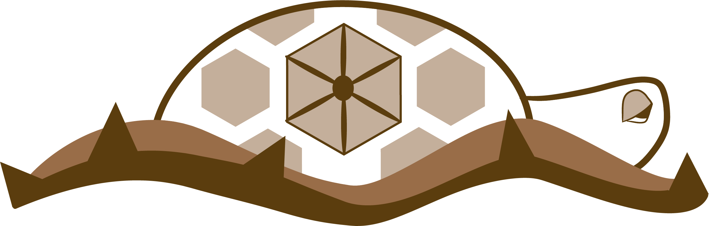

# Geometricus Represents Protein Structures as Shape-mers derived from Moment Invariants

A structure-based, alignment-free embedding approach for proteins. Can be used as input to machine learning algorithms.

See the [documentation](https://turtletools.github.io/geometricus/)

TODO: Add link to paper

## Installation
Geometricus is a Python (3.7+) package with NumPy, SciPy, Numba and ProDy as dependencies. Install from source using `git clone` and `pip install .` inside the cloned repository

TODO: Package with PyPI and anaconda.

## Usage
See the [Getting Started](https://turtletools.github.io/geometricus/getting_started) page for example usage.
