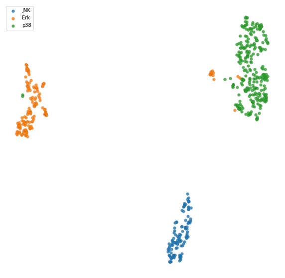
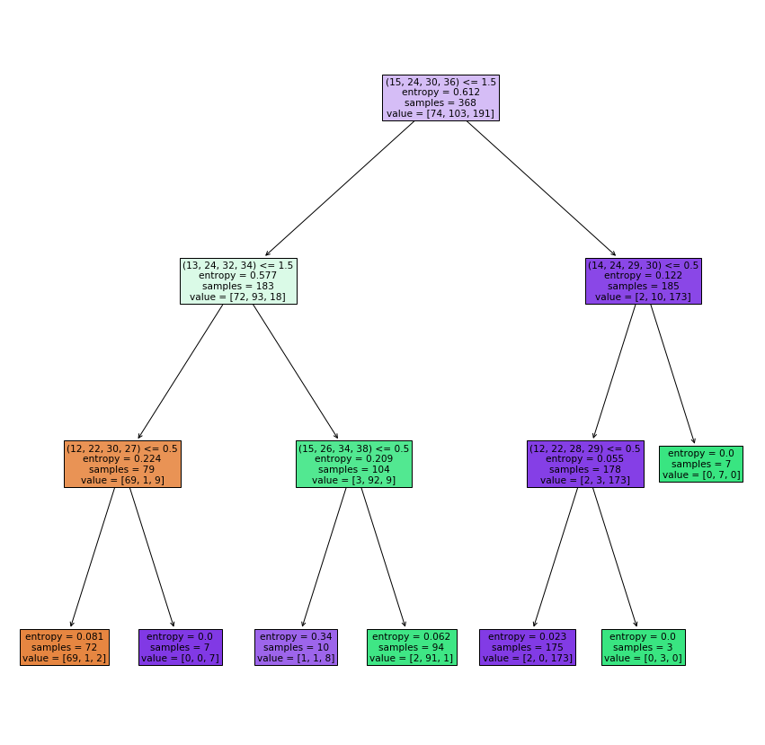

.. code:: ipython3

    import warnings
    warnings.filterwarnings('ignore')

Getting Started
===============

Let’s walk through an example application of Geometricus in machine
learning using a dataset of human MAP kinases, divided into three
classes - JNK, Erk, and p38 kinases. This dataset was generated from the
`Kinase-Ligand Interaction Fingerprints and Structures database
(KLIFS) <https://klifs.vu-compmedchem.nl/index.php>`__ (Raw table
`here <../../example_data/MAPK_KLIFS.tsv>`__).

.. code:: ipython3

    import pandas as pnd
    from pathlib import Path
    
    data_dir = Path("../../example_data")
    mapk_df = pnd.read_csv(data_dir / "MAPK_KLIFS.tsv", sep="\t")
    
    mapk_pdb_to_class = {}
    for pdb, chain, class_name in list(zip(mapk_df["PDB"], mapk_df["CHAIN"], mapk_df["CLASS"])):
        mapk_pdb_to_class[(pdb, chain)] = class_name
    len(mapk_pdb_to_class)

.. parsed-literal::

    527

So now we have a list of (PDB ID, chain) pairs, each associated with a
class

.. code:: ipython3

    X_names = list(mapk_pdb_to_class.keys())
    class_mapping = {"JNK": 0, "Erk": 1, "p38": 2}
    y = [class_mapping[mapk_pdb_to_class[k]] for k in X_names]

Structural fragmentation
------------------------

We consider two different ways of dividing a protein with :math:`l`
residues into structural fragments, a :math:`k`-mer-based approach and a
radius-based approach. For each structural fragment, four rotation and
translation-invariant moments are calculated, termed
:math:`O_1, O_2, O_3`, and :math:`O_4`. While the :math:`k`-mer based
approach is effective in describing structural fragments that are
sequential in nature, such as :math:`\alpha`-helices and loops, the
radius-based approach can capture long-range structural contacts as seen
in :math:`\beta`-sheets, as well as distinct interaction patterns in
space, as found in enzyme active sites.

Below we load a pickle file containing pre-parsed proteins stored as
ProDy AtomGroup objects. This can also be done directly from PDB files
by replacing the ``geometricus.MomentInvariants.from_prody_atomgroup``
call by
``geometricus.MomentInvariants.from_pdb_file(pdb_file, chain=chain, ...)``
or even ``from_pdb_id(pdb_id, chain=chain, ...)`` to download from RCSB
via FTP (note that these two approaches will take longer due to FTP
downloading time and file parsing time).

.. code:: ipython3

    from geometricus import geometricus
    import pickle
    from time import time
    
    invariants_kmer = {}
    invariants_radius = {}
    with open(data_dir / "atomgroups.pkl", "rb") as f:
        key_to_atomgroup = pickle.load(f)
    
    start_time = time()
    for i, key in enumerate(X_names):
        if i > 0 and i % 50 == 0:
            print(f"{i} proteins in {round(time() - start_time, 2)} seconds")
        invariants_kmer[key] = geometricus.MomentInvariants.from_prody_atomgroup(key, key_to_atomgroup[key], split_type="kmer", split_size=16)
        invariants_radius[key] = geometricus.MomentInvariants.from_prody_atomgroup(key, key_to_atomgroup[key], split_type="radius", split_size=10)

.. parsed-literal::

    50 proteins in 2.76 seconds
    100 proteins in 5.56 seconds
    150 proteins in 8.67 seconds
    200 proteins in 12.37 seconds
    250 proteins in 15.4 seconds
    300 proteins in 18.19 seconds
    350 proteins in 21.05 seconds
    400 proteins in 23.78 seconds
    450 proteins in 27.09 seconds
    500 proteins in 30.08 seconds

Generating an Embedding from Structural Fragments
-------------------------------------------------

Moment invariants are discretized into shape-mers, using a
**resolution** parameter which controls how coarse or fine-grained this
discretization is. A count vector of shape-mers is calculated for each
protein with each element recording the number of times the
corresponding shape-mer appears in that protein. The resolution
parameter can be optimized to the task at hand. Generally, more
divergent proteins would require a lower resolution while highly similar
proteins would need higher resolutions to differentiate them. For the
MAP kinases, we use a relatively high resolution of 2.

Depending on the use-case you may want to embed all proteins at once, as
demonstrated below, or separate train and test proteins as demonstrated
in the Supervised Learning section.

Embedding for Dimensionality Reduction
~~~~~~~~~~~~~~~~~~~~~~~~~~~~~~~~~~~~~~

Embeddings across all proteins can be used for dimensionality reduction
and visualization.

.. code:: ipython3

    import umap
    import numpy as np
    import matplotlib.pyplot as plt
    
    start_time = time()
    embedder = geometricus.GeometricusEmbedding(invariants_kmer, invariants_radius, resolution=2., protein_keys=X_names)
    print(f"Generated embedding in {round(time() - start_time, 2)} seconds")
    
    reducer = umap.UMAP(metric="cosine", n_components=2)
    reduced = reducer.fit_transform(embedder.embedding)
    
    class_names = ["JNK", "Erk", "p38"]
    colors = ["red", "green", "blue"]
    plt.figure(figsize=(10,10))
    for i in range(3):
        indices = np.where(np.array(y) == i)[0]
        plt.scatter(reduced[indices, 0],
                    reduced[indices, 1],
                    label=class_names[i], edgecolor="black", linewidth=0.1, alpha=0.8)
    plt.axis("off")
    plt.legend();

.. parsed-literal::

    Generated embedding in 2.02 seconds

Embedding for Supervised Learning
~~~~~~~~~~~~~~~~~~~~~~~~~~~~~~~~~

Supervised learning, be it classification or regression, requires some
form of training and test set separation. Below, the shape-mers used for
embedding are calculated from the training set and only those shape-mers
are counted in the test proteins.

.. code:: ipython3

    from sklearn.model_selection import train_test_split
    
    X_train_names, X_test_names, y_train, y_test = train_test_split(X_names, y, test_size=0.3)
    
    train_embedder = geometricus.GeometricusEmbedding(invariants_kmer, invariants_radius, resolution=2.,
                                                      protein_keys=X_train_names)
    
    test_embedder = geometricus.GeometricusEmbedding(invariants_kmer, invariants_radius, resolution=2.,
                                                     protein_keys=X_test_names,
                                                     kmer_shape_keys=train_embedder.kmer_shape_keys,
                                                     radius_shape_keys=train_embedder.radius_shape_keys)
    X_train, X_test = train_embedder.embedding, test_embedder.embedding

For this simple problem, a decision tree classifier is more than enough
to obtain good accuracy.

.. code:: ipython3

    from sklearn.tree import DecisionTreeClassifier
    from sklearn.metrics import classification_report
    
    clf = DecisionTreeClassifier(random_state=42, max_depth=3)
    clf.fit(X_train, y_train)
    y_pred = clf.predict(X_test)
    print(classification_report(y_test, y_pred, [0, 1, 2], class_names))

.. parsed-literal::

                  precision    recall  f1-score   support
    
             JNK       0.91      0.83      0.87        35
             Erk       0.98      0.98      0.98        44
             p38       0.94      0.97      0.96        80
    
        accuracy                           0.94       159
       macro avg       0.94      0.93      0.93       159
    weighted avg       0.94      0.94      0.94       159
    

Finding predictive residues and structural fragments
----------------------------------------------------

Since each shape-mer can be mapped back to the residues it describes, it
is easy to use Geometricus to determine predictive or functionally
relevant residues and structural regions from a trained predictor (or
from loadings generated from a method such as PCA). Such insights can be
directly be applied to select candidate residues for mutational studies
or used in directed evolution techniques to engineer proteins and
enzymes with desired properties.

By inspecting the decision tree created above, it becomes clear that
some shape-mers are present multiple times across a protein and the
number of times differs across classes.

.. code:: ipython3

    from sklearn.tree import plot_tree
    fig, ax = plt.subplots(1, figsize=(15,15))
    plot_tree(clf, filled=True, ax=ax, feature_names=train_embedder.kmer_shape_keys + train_embedder.radius_shape_keys);

.. code:: ipython3

    plt.plot(clf.feature_importances_)
    predictive_feature_indices = np.argsort(clf.feature_importances_)[::-1][:6]

.. image:: getting_started_files/getting_started_15_0.png

We can map back to the residues described by a shape-mer using the
``map_shapemer_index_to_residues`` function which returns a dictionary
mapping each protein to the corresponding residue indices of the
shape-mer within that protein, if it exists.

.. code:: ipython3

    shapemer = train_embedder.map_shapemer_index_to_shapemer(predictive_feature_indices[2])
    residue_indices_train = train_embedder.map_shapemer_index_to_residues(predictive_feature_indices[2])
    print("Shape-mer:", shapemer, "Number of proteins:", len(residue_indices_train))
    print("Residue indices per protein:")
    for key in residue_indices_train:
        print(key, residue_indices_train[pdb])

.. parsed-literal::

    Shape-mer: (14, 24, 29, 30) Number of proteins: 12
    Residue indices per protein:
    ('5bvd', 'A') {143, 144, 145, 146, 147, 148, 149, 150, 151, 152, 153, 154, 155, 156, 157, 158}
    ('4myg', 'B') {143, 144, 145, 146, 147, 148, 149, 150, 151, 152, 153, 154, 155, 156, 157, 158}
    ('6hkm', 'A') {143, 144, 145, 146, 147, 148, 149, 150, 151, 152, 153, 154, 155, 156, 157, 158}
    ('6hkn', 'A') {143, 144, 145, 146, 147, 148, 149, 150, 151, 152, 153, 154, 155, 156, 157, 158}
    ('2zoq', 'B') {143, 144, 145, 146, 147, 148, 149, 150, 151, 152, 153, 154, 155, 156, 157, 158}
    ('4zsg', 'A') {143, 144, 145, 146, 147, 148, 149, 150, 151, 152, 153, 154, 155, 156, 157, 158}
    ('5v61', 'A') {143, 144, 145, 146, 147, 148, 149, 150, 151, 152, 153, 154, 155, 156, 157, 158}
    ('5byy', 'A') {143, 144, 145, 146, 147, 148, 149, 150, 151, 152, 153, 154, 155, 156, 157, 158}
    ('4zsj', 'A') {143, 144, 145, 146, 147, 148, 149, 150, 151, 152, 153, 154, 155, 156, 157, 158}
    ('4ic7', 'A') {143, 144, 145, 146, 147, 148, 149, 150, 151, 152, 153, 154, 155, 156, 157, 158}
    ('5bvf', 'A') {143, 144, 145, 146, 147, 148, 149, 150, 151, 152, 153, 154, 155, 156, 157, 158}
    ('4ic7', 'D') {143, 144, 145, 146, 147, 148, 149, 150, 151, 152, 153, 154, 155, 156, 157, 158}

These residue indices can then be visualized on a protein structure
using molecule visualization software such as PyMol. Comparing the same
location in proteins which don’t have this shape-mer can also be
informative.
